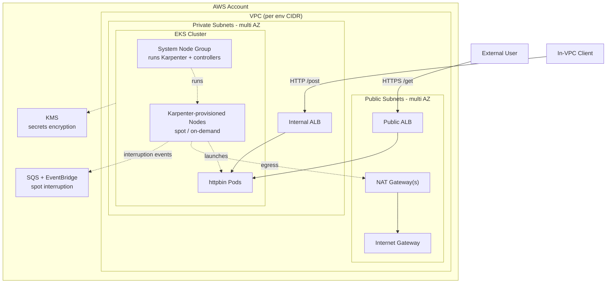
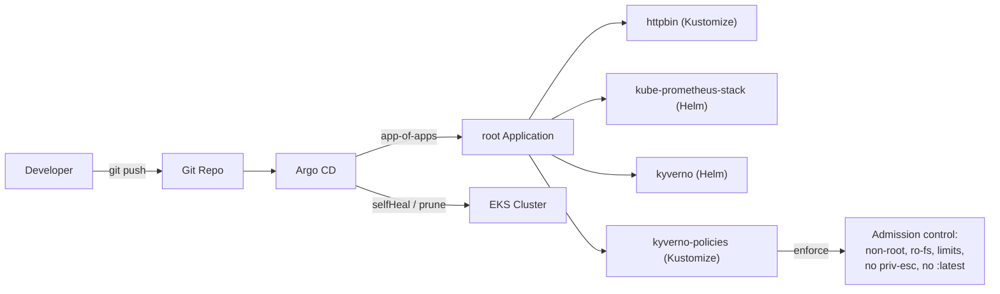

# EKS Platform — DevSecOps Gates, Predictive Scaling & DR (Terraform + GitOps + Karpenter + Kyverno)

> **Repo:** `eks-gate-forecast-dr`

A production-grade EKS platform that runs the [go-httpbin](https://github.com/mccutchen/go-httpbin)
service, built to demonstrate senior-level platform engineering:

- **Modular Terraform** (`network` / `eks` / `platform`) composed by thin
  **`dev` and `prod` environments** with separate state and per-env tuning.
- **GitOps** delivery via **Argo CD** (app-of-apps).
- **Karpenter** for dynamic, cost-aware node autoscaling.
- **Kyverno** enforcing pod-security policies cluster-wide.
- A **Prometheus/Grafana** observability stack on persistent storage.
- Defense-in-depth security: scoped API endpoint, KMS-encrypted secrets, IRSA
  everywhere, HTTPS ALB, hardened workloads, remote state with locking.

Endpoints: **`GET /get`** over HTTPS on an internet-facing ALB, and **`POST /post`**
on an internal (VPC-only) ALB.

---

## Project Evolution

This repo started as `eks-httpbin-alb` (Terraform + GitOps + Karpenter +
Kyverno on EKS) and is being extended into a broader platform-engineering
portfolio piece. short version:

- **Absorbed:** the security-gate *concept* (gitleaks, Semgrep, Checkov, `npm
  audit`, soft-fail vs. enforcing thresholds) from a separate
  `aws-devsecops-pipeline` project. That project's own CodePipeline /
  CodeBuild / CodeDeploy / EC2 delivery stack is **not** brought in here — it
  would duplicate the CD role Argo CD already plays. The original repo is kept
  as-is/archived, not deleted.
- **Added (in progress):** a full CI security-gate stage in this repo's own
  GitHub Actions workflow, a KEDA proactive/predictive autoscaling
  proof-of-concept, and a DR proof-of-concept (DynamoDB Global Tables + Route 53
  failover). These are explicitly **working proofs-of-concept, not
  production-hardened systems**

> **⚠️ Verification status.** The baseline platform (Terraform + GitOps +
> Karpenter + Kyverno, everything above the "Project Evolution" line) was
> previously deployed and tested end-to-end on real AWS infrastructure. The
> three additions below it — the expanded CI security gate, KEDA predictive
> scaling, and the DR proof-of-concept — were authored as a complete,
> internally-consistent design (code, IAM, GitOps wiring) without access to
> a live AWS account or network from the environment that wrote them, so
> they have **not** been run through `terraform validate`/`plan`/`apply` or
> a real CI run yet. Treat this code the way you'd treat a thorough PR from
> a colleague: read it, run it, and expect to fix small things (a Checkov
> finding, a KEDA scaler field name against whatever version you pin) on
> first contact — that first-contact debugging is itself covered as an
> exercise in the study guide, not glossed over.

## What this demonstrates

| Area | What's here | Phase |
| --- | --- | --- |
| Infrastructure as Code | Modular Terraform, remote state + locking, per-env tfvars | baseline |
| GitOps delivery | Argo CD app-of-apps, Kustomize + Helm sources, sync waves | baseline |
| Autoscaling (reactive) | Karpenter node autoscaling, cost-aware (spot/on-demand) | baseline |
| Policy enforcement | Kyverno admission policies (non-root, ro-fs, no `:latest`, limits) | baseline |
| Observability | kube-prometheus-stack (Prometheus/Grafana/Alertmanager) | baseline |
| Security posture | IRSA everywhere, KMS, scoped API endpoint, encrypted state | baseline |
| DevSecOps CI gate | gitleaks + Semgrep + Checkov + npm-audit-if-applicable, real blocking gate | Phase 2 |
| Predictive autoscaling | KEDA `aws-cloudwatch` trigger scaling off a forecast metric, not live load | Phase 3 — **POC**, classical smoothing, not ML |
| Disaster recovery | DynamoDB Global Tables + Route 53 health-check failover, Lambda-backed | Phase 4 — **POC**, run once and torn down, not always-on |

---

## Architecture

### Infrastructure & node lifecycle



### Delivery & governance (GitOps)



### Responsibility split

| Layer | Owned by | Why |
| --- | --- | --- |
| VPC, EKS, IAM, KMS, Karpenter IAM/queue | Terraform | Needs cloud APIs and IAM. |
| LB Controller, EBS CSI, Argo CD, Karpenter | Terraform (Helm/addons) | IRSA-dependent platform components. |
| Karpenter NodePool / EC2NodeClass | Terraform (local chart) | Needs Terraform-computed node role + discovery tags. |
| httpbin, monitoring, Kyverno + policies | **Argo CD** | Reconciled from Git. |

---

## Repository layout

```
terraform/
├── bootstrap/                     # ONE-TIME: S3 state bucket + DynamoDB lock table
├── modules/
│   ├── network/                   # VPC, subnets, NAT (single or per-AZ), discovery tags
│   ├── eks/                       # cluster, KMS, OIDC, system node group, access config
│   ├── platform/                  # IRSA add-ons + Karpenter + Argo CD + KEDA/predictive-scaler IRSA
│   │   ├── lb-controller.tf
│   │   ├── ebs-csi.tf
│   │   ├── argocd.tf
│   │   ├── karpenter.tf
│   │   ├── keda.tf                       # IRSA only — KEDA itself installs via Argo CD
│   │   ├── predictive-scaler.tf          # IRSA only — CronJob installs via Argo CD
│   │   ├── policies/*.json[.tpl]         # IAM policies (templated where needed)
│   │   └── charts/karpenter-resources/   # NodePool + EC2NodeClass Helm chart
│   └── dr/                        # DR POC — DynamoDB Global Table, Lambda x2, API GW x2, Route 53 (Phase 4, off by default)
└── environments/
    ├── dev/                       # single NAT, small nodes, spot-first (cheap); instantiates module "dr"
    └── prod/                      # NAT per AZ, larger nodes, on-demand-first (HA)

gitops/
├── appproject.yaml                # RBAC boundary
├── root-app.yaml                  # app-of-apps
├── apps/                          # httpbin, monitoring, kyverno, kyverno-policies, keda, predictive-scaling
└── policies/                      # Kyverno ClusterPolicies (enforce)

k8s/                               # httpbin app (Kustomize, applied by Argo CD)
└── predictive-scaling/            # forecast.py + CronJob + KEDA ScaledObject + k6 load test (Phase 3)

.github/workflows/                 # security-gate (gitleaks/semgrep/checkov/npm-audit) • fmt • validate • tflint • tfsec • plan
.checkov.yaml                      # IaC scan config — no blanket suppressions, see file header
CHANGELOG.md                       # phase-by-phase project history and the decisions behind it
```

---

## What changes between `dev` and `prod`

Only `terraform.tfvars` differs — same modules, separate state:

| | dev | prod |
| --- | --- | --- |
| NAT gateways | 1 (shared) | 1 per AZ |
| VPC CIDR | 10.10.0.0/16 | 10.20.0.0/16 |
| System nodes | 2× t3.large | 3× m5.large |
| Karpenter capacity | spot-first, cap 50 vCPU | on-demand-first, cap 300 vCPU |
| API endpoint CIDRs | your IP | corporate/CI range |

---

## Deployment

### 1. Bootstrap remote state (once)

```bash
cd terraform/bootstrap
terraform init
terraform apply -var 'state_bucket_name=my-unique-tfstate-bucket'
terraform output -raw backend_hcl_snippet > ../environments/dev/backend.hcl
# (repeat the snippet into environments/prod/backend.hcl too)
```

### 2. Provision an environment

```bash
cd terraform/environments/dev
# edit terraform.tfvars: set endpoint_public_access_cidrs to YOUR IP
terraform init -backend-config=backend.hcl
terraform apply
```

This builds the VPC, EKS (KMS-encrypted, scoped endpoint), the system node group,
the LB Controller + EBS CSI (IRSA), Karpenter (controller + NodePool/NodeClass),
and Argo CD. Prod is identical: `cd ../prod && terraform init -backend-config=backend.hcl && terraform apply`.

### 3. Seed GitOps (once per cluster)

```bash
aws eks update-kubeconfig --region us-east-1 --name httpbin-dev
# set CHANGE-ME repo URLs in gitops/*.yaml and the ACM ARN in k8s/ingress-public.yaml, commit
kubectl apply -f gitops/appproject.yaml
kubectl apply -f gitops/root-app.yaml
```

Argo CD then reconciles httpbin, the monitoring stack, and Kyverno + policies.

### 4. Verify

```bash
kubectl get applications -n argocd
kubectl get nodepools,ec2nodeclasses         # Karpenter
kubectl get clusterpolicies                  # Kyverno
kubectl get pods -n monitoring
```

---

## Karpenter

The **system managed node group** runs only Karpenter and core controllers.
Karpenter then watches for unschedulable pods and launches right-sized nodes from
a `NodePool`/`EC2NodeClass`, consolidating them when they're empty or
underutilized. It discovers subnets and security groups by the
`karpenter.sh/discovery` tag (set in the network/eks modules), assumes a node role
via an EKS **access entry**, and handles spot interruptions through an SQS queue
fed by EventBridge. Per-env tuning (instance families, spot vs on-demand, vCPU
ceiling) flows from `terraform.tfvars` into the NodePool chart values.

## Kyverno

Kyverno enforces the same hardening the httpbin pod already meets, cluster-wide,
as admission policies (mode `Enforce`): no `:latest` tags, run-as-non-root,
read-only root filesystem, required CPU/memory limits, and no privilege
escalation. System namespaces (kube-system, argocd, monitoring, kyverno,
karpenter) are excluded because their operators need elevated privileges. This
turns "we followed best practices" into "the cluster rejects anything that
doesn't."

## Observability

`kube-prometheus-stack` (Prometheus, Alertmanager, Grafana, node-exporter,
kube-state-metrics) via Argo CD, all backed by encrypted `gp3` PVCs. You get
node/pod/container metrics and Kubernetes object health out of the box; go-httpbin
exposes no `/metrics`, so its signals come from kube-state-metrics and cAdvisor.

```bash
kubectl -n monitoring port-forward svc/kube-prometheus-stack-grafana 3000:80
```

---

## Predictive/proactive autoscaling — KEDA

**Framing: a lightweight proactive-autoscaling proof-of-concept, not a
production ML pipeline.**

A CronJob (`k8s/predictive-scaling/`) runs every 5 minutes, pulls recent ALB
`RequestCount` history from CloudWatch (go-httpbin exposes no `/metrics`, so
this — not Prometheus — is the request-rate signal), computes a forecast
using a weighted moving average with a same-time-yesterday seasonal nudge
(classical time-series smoothing, explicitly **not** a trained model), and
publishes a desired-replica-count as a custom CloudWatch metric. KEDA's
`aws-cloudwatch` trigger scales the `httpbin` Deployment off that forecast,
so it can scale out *ahead of* a known, recurring traffic ramp instead of
only reacting after load has already landed — the structural thing a plain
HPA can't do.

The ALB itself is GitOps-managed (created by the AWS Load Balancer
Controller reconciling the Ingress), so Terraform never sees its ARN; the
forecast script resolves the ALB's fixed name to today's ARN via the AWS API
at every run, rather than hardcoding a value that would go stale on ALB
recreation.

The actual portfolio artifact isn't the YAML — it's a recorded, side-by-side
comparison of the same synthetic traffic ramp run once against a plain
reactive HPA (`k8s/predictive-scaling/reactive-hpa-baseline.yaml`) and once
against the KEDA ScaledObject.

## Disaster recovery — DynamoDB Global Tables + Route 53

**Framing: DR mechanics demonstrated and tested once, not a
permanently-running multi-region deployment.** `enable_dr_poc` defaults to
`false` in `terraform.tfvars` — nothing here costs anything until you flip
it on to run the test.

- **DynamoDB Global Tables** (V2) replicate one small table between a
  primary and secondary region — no Aurora Global Database, no
  provider-alias complexity for the data layer itself (Global Tables are a
  single resource with a `replica` block).
- **The app-layer endpoint is a Lambda, not a change to go-httpbin.**
  go-httpbin is a prebuilt third-party image with no source in this repo to
  patch; forking it to add one trivial `/dr-check` route would be a bigger,
  messier change than the "minimal app-layer change" this phase calls for.
  A small Lambda behind its own API Gateway HTTP API, deployed identically
  to both regions, is a smaller blast radius and needs no image
  build/push/ECR step. This is a deliberate deviation from a literal reading
  of the plan, worth being able to explain as such.
- **Route 53 failover routing** with health checks against each region's
  API Gateway drives the actual failover; a short (30s) TTL keeps DNS
  propagation from dominating your measured RTO.
- Running the real test — breaking the primary health check, measuring
  detection + failover time, confirming the secondary serves reads/writes
  against the replicated table, failing back, then tearing the DR resources
  back down (`enable_dr_poc = false` + apply).
  The measured RTO number from that run, not this README, is
  the artifact an interviewer actually wants to hear about.

---

## Security summary

Scoped public API endpoint (validation rejects `0.0.0.0/0`); KMS envelope
encryption for secrets; IRSA for the LB Controller, EBS CSI, Karpenter, KEDA
operator, and predictive-scaler CronJob (no node-role permissions, no static
keys — each principal scoped to exactly what it does, e.g. the predictive-
scaler can `PutMetricData` only into its own CloudWatch namespace); HTTPS ALB
with TLS redirect; private nodes with SSM access; hardened pods enforced by
Kyverno; encrypted, versioned, TLS-only state bucket; and pinned versions
throughout. CI runs a blocking DevSecOps gate (gitleaks, Semgrep, Checkov,
npm-audit-if-applicable) before `tfsec` + `tflint` on every PR, and
authenticates to AWS via OIDC. The DR Lambda execution role is likewise
scoped to `GetItem`/`PutItem` on exactly the one DR table, in either region.

---

## CI

`.github/workflows/terraform.yml`:

1. **`security-gate`** — gitleaks (secrets, whole repo) → Semgrep (SAST,
   scoped to this repo's actual custom logic) → npm audit (SCA, only if a
   `package.json` exists — it currently doesn't) → Checkov (IaC, `terraform/`).
   Fails the job on any finding unless the `SECURITY_SOFT_FAIL` repo variable
   is set to demo a green run on purpose. See `.checkov.yaml` for the
   no-blanket-suppression policy on any skips.
2. **`validate`** (needs `security-gate`) — `fmt`, `validate`, `tflint`, `tfsec`.
3. **`plan`** (needs `validate`) — OIDC-authenticated `terraform plan`.

In a real setup you'd run a matrix over `dev`/`prod` env directories.

---

## Cleanup

```bash
kubectl delete -f gitops/root-app.yaml     # let Argo CD prune the app layer
cd terraform/environments/dev && terraform destroy -var-file=terraform.tfvars
# then prod, then bootstrap (state bucket has prevent_destroy)
```

If you ran the DR proof-of-concept, tear it down on its own first
(cheaper and faster than waiting for a full `destroy`, and lets you keep the
rest of the platform running while you do it):

```bash
cd terraform/environments/dev
# set enable_dr_poc = false in terraform.tfvars, then:
terraform apply -var-file=terraform.tfvars
```

---

## Design decisions & trade-offs

- **Modules + per-env tfvars, separate state.** One source of truth for
  infrastructure, environment differences expressed only as data. Prod gets HA
  NAT and on-demand capacity; dev stays cheap.
- **System node group + Karpenter, not a static ASG.** Karpenter runs on a small
  fixed node group and provisions everything else on demand, bin-packing and
  consolidating for cost. It should never manage the nodes it runs on — hence the
  split.
- **NodePool/NodeClass in Terraform, workloads in GitOps.** The NodePool needs
  Terraform-computed values (node role, discovery tag) and the Karpenter CRDs, so
  it ships as a local Helm chart from Terraform. Pure workloads stay in Git.
- **Kyverno in GitOps, split install vs policies.** Kyverno needs no AWS IAM, so
  it's GitOps-native; policies are a separate Application so they apply after the
  Kyverno CRDs exist (Argo CD retries).
- **KEDA/predictive-scaler: same split, one level deeper.** Both need IRSA
  (an AWS-facing concern), so their IAM roles are Terraform-managed — but
  neither needs any other Terraform-computed value, so the workloads
  themselves (Helm release, CronJob, ScaledObject) stay in GitOps, referencing
  the role ARN as a plain, deterministic string rather than threading a
  Terraform output through to Git.
- **DR: Lambda instead of modifying go-httpbin.** go-httpbin is a prebuilt
  third-party image with no source here to patch. A Lambda behind its own
  API Gateway HTTP API is a smaller blast radius, deploys identically to a
  second region with no image build/push/ECR step, and keeps the "minimal
  app-layer change" intent of the DR POC honest rather than nominal.
- **DR: DynamoDB Global Tables over Aurora Global Database.** Cheaper,
  serverless, and — because Global Tables V2 is a single resource with a
  `replica` block — needs no cross-region provider complexity for the data
  layer itself (Lambda and API Gateway still do, since those are genuinely
  regional).
- **DR: `enable_dr_poc` feature flag, not a separate environment.** Keeps the
  DR resources' lifecycle explicit and reviewable in the same `terraform.tfvars`
  diff you'd already be looking at, and makes "did we tear this down" a
  single grep-able line instead of a separate state file to remember exists.
- **Argo CD seeded with `kubectl`, not `kubernetes_manifest`** — avoids the
  plan-time CRD ordering footgun.
- **IRSA everywhere with `sub` and `aud` conditions.** Short-lived, per-workload
  credentials instead of node-wide permissions.
- **Everything pinned** (K8s version, all Helm charts, container image, EBS CSI
  addon) for reproducible builds.

> Chart versions (ALB controller, Argo CD, Karpenter, kube-prometheus-stack,
> Kyverno, KEDA) are pinned to **example** values — verify against `helm search
> repo` before applying in your account.

---

## Possible next steps

Argo CD ApplicationSet to template per-env overlays; `external-dns` +
`cert-manager` to automate DNS/TLS; Trivy image scanning and Cosign signing in CI;
cost visibility via Infracost in the pipeline; swap the moving-average forecast
for Amazon Forecast or a trained model; multi-account separation (staging vs
prod) for the DR failover story to mean something beyond a POC; WAF in front
of the public ALB.
